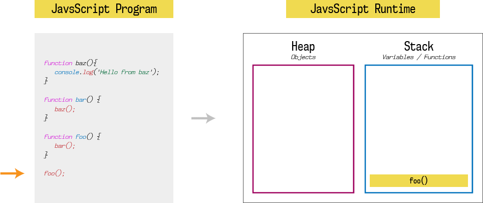
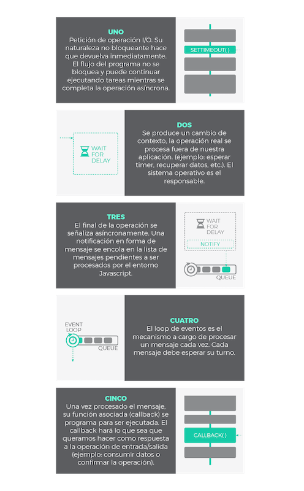
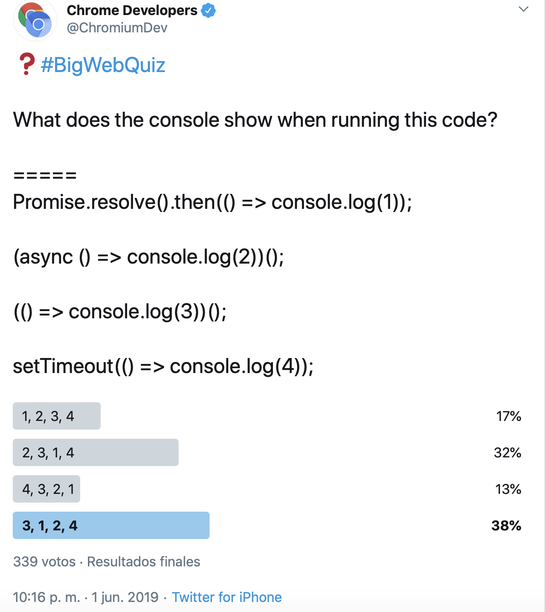

<!-- .slide: class="titulo" -->

# Tema 2: Desarrollo en el cliente con Javascript estándar 
## Parte 3: El *event loop* en Javascript


---


```javascript
setTimeout(function(){
  console.log("Esto debería aparecer primero");
}, 0);
console.log("Sorpresa!");
```
[https://jsbin.com/bibifan/edit?js,console](https://jsbin.com/bibifan/edit?js,console)

---


> Javascript utiliza un modelo asíncrono y no bloqueante, con un *loop* de eventos implementado con un único *thread* para sus interfaces de entrada/salida

[https://lemoncode.net/lemoncode-blog/2018/1/29/javascript-asincrono](https://lemoncode.net/lemoncode-blog/2018/1/29/javascript-asincrono) <!-- .element class="caption"-->


---

## El *runtime* de Javascript

Los motores JS como V8/Spidermonkey implementan lo "más básico": el *heap* y el *stack*

 <!-- .element class="stretch"-->

[https://itnext.io/how-javascript-works-in-browser-and-node-ab7d0d09ac2f](https://itnext.io/how-javascript-works-in-browser-and-node-ab7d0d09ac2f) <!-- .element class="caption"-->

---


 
<!-- .element class="stretch"-->
[https://lemoncode.net/lemoncode-blog/2018/1/29/javascript-asincrono](https://lemoncode.net/lemoncode-blog/2018/1/29/javascript-asincrono) <!-- .element class="caption"-->


---

El *loop* de eventos no se procesa hasta que el *call stack* se queda vacío, lo que explica el ejemplo que vimos al principio

```javascript
setTimeout(function(){
  console.log("Esto debería aparecer primero");
}, 0);
console.log("Sorpresa!");
```
[Loupe, una herramienta para visualizar el *event loop*](http://latentflip.com/loupe/?code=c2V0VGltZW91dChmdW5jdGlvbiB0aW1lcigpewogIGNvbnNvbGUubG9nKCJFc3RvIGRlYmVy7WEgYXBhcmVjZXIgcHJpbWVybyIpOwp9LCAwKTsKY29uc29sZS5sb2coIlNvcnByZXNhISIpOw%3D%3D!!!PGJ1dHRvbj5DbGljayBtZSE8L2J1dHRvbj4%3D)

---

Os podéis imaginar el *loop* de eventos como "el bucle principal" del intérprete

```javascript
while (true) {
    task = taskQueue.pop()
    execute(task)
}
```

- En la especificación se permite que haya más de una cola de tareas, por ejemplo Node usa una cola separada para los *timers*
- En navegadores, estamos ignorando otra cola de tareas que se ocupa del *rendering*

---

## Microtareas

- Casi siempre asociadas a la resolución/rechazo de una promesa
- Se ejecutan inmediatamente después de la tarea actual, hasta que no terminan todas no se sigue con las "macro"tareas

```javascript
while (true) {
    queue = getNextQueue()
    task = queue.pop()
    execute(task)
    while(!microtaskQueue.empty()) {
        doMicrotask()
    }
}
```

---

 
<!-- .element class="stretch"-->
[https://jsbin.com/lexujo/edit?js,console](https://jsbin.com/lexujo/edit?js,console) <!-- .element class="caption"-->

---

Referencias

- [https://lemoncode.net/lemoncode-blog/2018/1/29/javascript-asincrono](https://lemoncode.net/lemoncode-blog/2018/1/29/javascript-asincrono)
- [Philip Roberts: What the heck is the event loop anyway? | JSConf EU](https://www.youtube.com/watch?v=8aGhZQkoFbQ)
- [Further Adventures of the Event Loop - Erin Zimmer - JSConf EU 2018](https://www.youtube.com/watch?v=u1kqx6AenYw)
